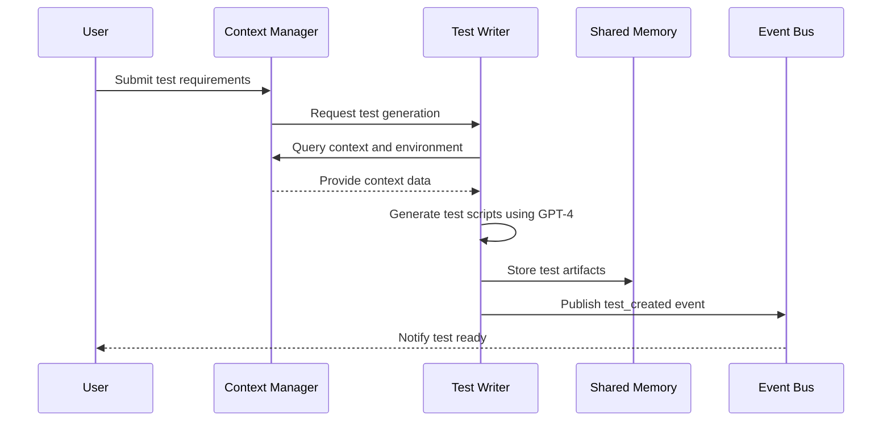
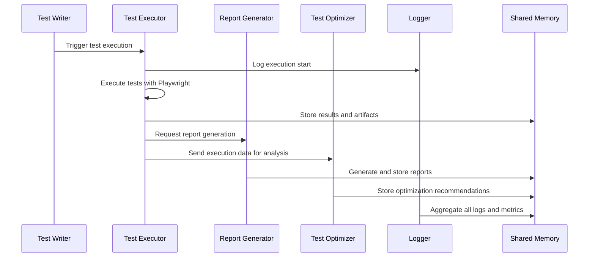
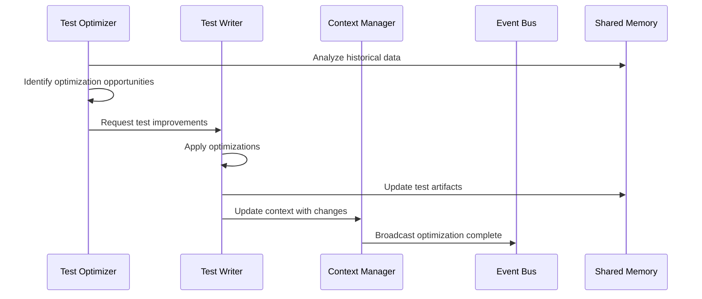

# Multi-Agent Software Testing Framework Architecture

## Table of Contents
1. [System Overview](#system-overview)
2. [Architecture Principles](#architecture-principles)
3. [Agent Specifications](#agent-specifications)
4. [Communication Protocols](#communication-protocols)
5. [Data Flow Patterns](#data-flow-patterns)
6. [Technology Stack Integration](#technology-stack-integration)
7. [System Components](#system-components)
8. [Deployment Architecture](#deployment-architecture)
9. [Security & Monitoring](#security--monitoring)
10. [Extensibility & Scalability](#extensibility--scalability)

## System Overview

### Vision
The Multi-Agent Software Testing Framework is an intelligent, collaborative system that automates comprehensive web application testing through specialized AI agents. The framework leverages GPT-4's reasoning capabilities, Playwright's robust testing infrastructure, and multi-agent design patterns to deliver reliable, scalable, and maintainable test automation.

### High-Level Architecture

```
┌─────────────────────────────────────────────────────────────────┐
│                    Multi-Agent Testing Framework                │
├─────────────────────────────────────────────────────────────────┤
│  ┌─────────────┐  ┌─────────────┐  ┌─────────────┐  ┌─────────┐ │
│  │   Test      │  │    Test     │  │   Report    │  │  Test   │ │
│  │   Writer    │  │  Executor   │  │ Generator   │  │Optimizer│ │
│  │   Agent     │  │   Agent     │  │   Agent     │  │ Agent   │ │
│  └─────────────┘  └─────────────┘  └─────────────┘  └─────────┘ │
│         │                 │                 │             │     │
│  ┌─────────────┐  ┌─────────────────────────────────────────────┐ │
│  │  Context    │  │              Logger Agent               │ │
│  │  Manager    │  │                                         │ │
│  │   Agent     │  │                                         │ │
│  └─────────────┘  └─────────────────────────────────────────────┘ │
├─────────────────────────────────────────────────────────────────┤
│                    Communication Layer                         │
│  ┌─────────────┐  ┌─────────────┐  ┌─────────────┐  ┌─────────┐ │
│  │   Message   │  │    Event    │  │   Shared    │  │  Task   │ │
│  │    Queue    │  │    Bus      │  │   Memory    │  │ Queue   │ │
│  └─────────────┘  └─────────────┘  └─────────────┘  └─────────┘ │
├─────────────────────────────────────────────────────────────────┤
│                    Integration Layer                           │
│  ┌─────────────┐  ┌─────────────┐  ┌─────────────┐  ┌─────────┐ │
│  │ Playwright  │  │   OpenAI    │  │ Monitoring  │  │  Local  │ │
│  │    MCP      │  │   GPT-4     │  │   Tools     │  │Storage │ │
│  └─────────────┘  └─────────────┘  └─────────────┘  └─────────┘ │
└─────────────────────────────────────────────────────────────────┘
```

### Core Capabilities
- **Functional UI Testing**: Automated user interaction testing across multiple browsers
- **Accessibility Testing**: WCAG compliance validation and accessibility tree analysis
- **Performance Testing**: Load time, resource usage, and performance metric collection
- **Cross-Browser Testing**: Chromium, Firefox, and WebKit support
- **Intelligent Test Generation**: AI-powered test case creation and optimization
- **Comprehensive Reporting**: Detailed test reports with visual evidence and analytics

## Architecture Principles

### 1. Multi-Agent Collaboration Pattern
Each agent has specialized responsibilities and communicates through well-defined protocols, following the multi-agent collaboration design pattern for enhanced reliability and maintainability.

### 2. Reflection Pattern
Agents continuously self-evaluate and refine their outputs, ensuring iterative improvement in test quality and execution efficiency.

### 3. Tool Use Pattern
Agents leverage external tools (Playwright, monitoring systems, file systems) to extend capabilities beyond LLM reasoning.

### 4. Planning Pattern
Complex testing workflows are decomposed into sequential and parallel subtasks with dynamic adaptation based on real-time feedback.

### 5. Isolation and Independence
Each test execution runs in isolated browser contexts, preventing interference and ensuring reproducible results.

### 6. Event-Driven Architecture
Asynchronous communication through events enables scalable, non-blocking operations across agents.

## Agent Specifications

### 1. Test Writer Agent

**Primary Responsibility**: Intelligent test case generation and maintenance

**Core Capabilities**:
- AI-powered test scenario creation using GPT-4
- Page Object Model (POM) pattern implementation
- Test data generation and parameterization
- Accessibility test case creation
- Performance test scenario design

**Input Interfaces**:
- Website URLs and specifications
- User requirements and acceptance criteria
- Existing test suites for enhancement
- Context from Context Manager Agent

**Output Interfaces**:
- Playwright test scripts (.spec.ts files)
- Page object classes
- Test data fixtures
- Test configuration files

**Internal Modules**:
```typescript
interface TestWriterAgent {
  testGenerator: TestGenerationEngine;
  pomBuilder: PageObjectModelBuilder;
  dataGenerator: TestDataGenerator;
  accessibilityAnalyzer: AccessibilityTestBuilder;
  performanceTestBuilder: PerformanceTestBuilder;
  codeOptimizer: TestCodeOptimizer;
}
```

**Error Handling**:
- Invalid URL validation and sanitization
- Malformed requirement parsing with user feedback
- Code generation failure recovery with alternative approaches
- Dependency conflict resolution

**Communication Protocols**:
- Receives test requests via Task Queue
- Publishes test artifacts to Shared Memory
- Sends completion events to Event Bus
- Requests context updates from Context Manager

### 2. Test Executor Agent

**Primary Responsibility**: Test execution orchestration and result collection

**Core Capabilities**:
- Multi-browser test execution (Chromium, Firefox, WebKit)
- Parallel and sequential test execution strategies
- Real-time test monitoring and intervention
- Screenshot and video capture
- Network request/response logging
- Performance metrics collection

**Input Interfaces**:
- Test scripts from Test Writer Agent
- Execution configurations and parameters
- Browser and device specifications
- Environment variables and secrets

**Output Interfaces**:
- Test execution results and artifacts
- Performance metrics and traces
- Error logs and debugging information
- Visual evidence (screenshots, videos)

**Internal Modules**:
```typescript
interface TestExecutorAgent {
  executionEngine: PlaywrightExecutionEngine;
  browserManager: BrowserContextManager;
  resultCollector: TestResultCollector;
  performanceMonitor: PerformanceMetricsCollector;
  visualCapture: ScreenshotVideoCapture;
  networkMonitor: NetworkTrafficAnalyzer;
}
```

**Error Handling**:
- Browser crash recovery and retry mechanisms
- Network timeout handling with exponential backoff
- Element not found graceful degradation
- Memory leak detection and cleanup
- Test timeout management

**Communication Protocols**:
- Receives execution requests from Message Queue
- Streams real-time updates via Event Bus
- Stores results in Shared Memory
- Triggers report generation events

### 3. Report Generator Agent

**Primary Responsibility**: Comprehensive test report creation and visualization

**Core Capabilities**:
- Multi-format report generation (HTML, PDF, JSON)
- Interactive dashboards with drill-down capabilities
- Trend analysis and historical comparisons
- Accessibility compliance reporting
- Performance benchmark visualization
- CI/CD integration reports

**Input Interfaces**:
- Test execution results from Test Executor
- Historical test data from storage
- Report templates and configurations
- Stakeholder requirements for reporting

**Output Interfaces**:
- HTML interactive reports with embedded media
- PDF executive summaries
- JSON API responses for integrations
- Dashboard data feeds

**Internal Modules**:
```typescript
interface ReportGeneratorAgent {
  reportBuilder: MultiFormatReportBuilder;
  visualizationEngine: ChartAndGraphGenerator;
  templateEngine: ReportTemplateProcessor;
  trendAnalyzer: HistoricalDataAnalyzer;
  accessibilityReporter: WCAGComplianceReporter;
  performanceAnalyzer: PerformanceReportGenerator;
}
```

**Error Handling**:
- Missing data interpolation and flagging
- Template rendering failure recovery
- Large dataset pagination and optimization
- Export format compatibility validation

**Communication Protocols**:
- Subscribes to test completion events
- Queries historical data from storage systems
- Publishes report availability notifications
- Integrates with external monitoring dashboards

### 4. Test Optimizer Agent

**Primary Responsibility**: Continuous test improvement and maintenance

**Core Capabilities**:
- Flaky test detection and stabilization
- Test execution time optimization
- Redundant test identification and consolidation
- Selector stability analysis and improvement
- Test coverage gap identification
- Performance bottleneck analysis

**Input Interfaces**:
- Test execution history and patterns
- Performance metrics and timing data
- Failure analysis reports
- Code coverage information

**Output Interfaces**:
- Optimized test scripts and configurations
- Maintenance recommendations
- Performance improvement suggestions
- Test suite restructuring proposals

**Internal Modules**:
```typescript
interface TestOptimizerAgent {
  flakyTestDetector: FlakyTestAnalyzer;
  performanceOptimizer: ExecutionTimeOptimizer;
  coverageAnalyzer: TestCoverageAnalyzer;
  selectorStabilizer: SelectorOptimizer;
  redundancyDetector: DuplicateTestFinder;
  maintenanceScheduler: TestMaintenanceManager;
}
```

**Error Handling**:
- Statistical analysis validation
- Optimization recommendation verification
- Rollback mechanisms for failed optimizations
- Performance regression detection

**Communication Protocols**:
- Analyzes data from Shared Memory
- Publishes optimization recommendations
- Schedules maintenance tasks
- Integrates with version control systems

### 5. Context Manager Agent

**Primary Responsibility**: Centralized context and state management

**Core Capabilities**:
- Test environment state tracking
- Cross-agent context sharing
- Session and authentication management
- Test data lifecycle management
- Configuration and settings coordination
- Dependency and version management

**Input Interfaces**:
- Environment configurations
- Authentication credentials and tokens
- Test data requirements
- Agent state updates

**Output Interfaces**:
- Centralized context API
- Environment status reports
- Configuration validation results
- State synchronization events

**Internal Modules**:
```typescript
interface ContextManagerAgent {
  stateManager: GlobalStateManager;
  authManager: AuthenticationManager;
  configManager: ConfigurationManager;
  dataManager: TestDataManager;
  environmentTracker: EnvironmentStateTracker;
  dependencyManager: DependencyVersionManager;
}
```

**Error Handling**:
- State corruption detection and recovery
- Authentication failure handling
- Configuration conflict resolution
- Data consistency validation

**Communication Protocols**:
- Provides context API to all agents
- Maintains persistent state storage
- Broadcasts configuration changes
- Coordinates agent initialization

### 6. Logger Agent

**Primary Responsibility**: Comprehensive logging, monitoring, and observability

**Core Capabilities**:
- Structured logging across all agents
- Real-time log aggregation and analysis
- Performance metrics collection
- Error tracking and alerting
- Audit trail maintenance
- System health monitoring

**Input Interfaces**:
- Log streams from all agents
- System metrics and performance data
- Error reports and exceptions
- User actions and system events

**Output Interfaces**:
- Centralized log storage
- Real-time monitoring dashboards
- Alert notifications
- Audit reports and compliance logs

**Internal Modules**:
```typescript
interface LoggerAgent {
  logAggregator: LogStreamAggregator;
  metricsCollector: SystemMetricsCollector;
  alertManager: AlertingSystem;
  auditTracker: AuditTrailManager;
  healthMonitor: SystemHealthMonitor;
  logAnalyzer: LogPatternAnalyzer;
}
```

**Error Handling**:
- Log storage failure recovery
- Metric collection interruption handling
- Alert delivery failure retry mechanisms
- Log parsing error management

**Communication Protocols**:
- Receives logs via dedicated log channels
- Publishes health status updates
- Triggers alerts through external systems
- Provides query API for log analysis

## Communication Protocols

### 1. Message Queue System

**Technology**: Redis-based message queuing with persistence

**Message Types**:
- `TEST_REQUEST`: Test execution requests with parameters
- `TEST_COMPLETE`: Test completion notifications with results
- `OPTIMIZATION_TASK`: Test optimization and maintenance tasks
- `REPORT_REQUEST`: Report generation requests
- `CONTEXT_UPDATE`: Context and state change notifications

**Message Format**:
```typescript
interface AgentMessage {
  id: string;
  type: MessageType;
  source: AgentType;
  target: AgentType | 'BROADCAST';
  timestamp: Date;
  payload: any;
  priority: 'LOW' | 'NORMAL' | 'HIGH' | 'CRITICAL';
  retryCount: number;
  expiresAt?: Date;
}
```

### 2. Event Bus Architecture

**Technology**: EventEmitter-based pub/sub with Redis backing

**Event Categories**:
- `agent.lifecycle.*`: Agent startup, shutdown, health events
- `test.execution.*`: Test start, progress, completion events
- `system.performance.*`: Performance metrics and alerts
- `error.handling.*`: Error occurrences and recovery events
- `optimization.*`: Optimization recommendations and actions

**Event Schema**:
```typescript
interface SystemEvent {
  eventId: string;
  eventType: string;
  source: string;
  timestamp: Date;
  data: Record<string, any>;
  correlationId?: string;
  tags: string[];
}
```

### 3. Shared Memory System

**Technology**: Redis with JSON document storage

**Data Categories**:
- `test-artifacts`: Generated test scripts and configurations
- `execution-results`: Test results, screenshots, and logs
- `context-data`: Shared context and environment state
- `performance-metrics`: System and test performance data
- `optimization-data`: Analysis results and recommendations

**Access Patterns**:
- **Read-Heavy**: Test results, context data
- **Write-Heavy**: Logs, performance metrics
- **Transactional**: Context updates, state changes

## Data Flow Patterns

### 1. Test Creation Flow



### 2. Test Execution Flow



### 3. Optimization Flow



## Technology Stack Integration

### 1. Playwright MCP Integration

**Connection Architecture**:
```typescript
interface PlaywrightMCPIntegration {
  mcpClient: MCPClient;
  browserManager: BrowserManager;
  testRunner: PlaywrightTestRunner;
  
  async executeBrowserAction(action: BrowserAction): Promise<ActionResult>;
  async captureAccessibilityTree(): Promise<AccessibilityTree>;
  async collectPerformanceMetrics(): Promise<PerformanceMetrics>;
}
```

**Capabilities Exposed**:
- Browser automation and control
- Element interaction and validation
- Network request interception
- Performance metrics collection
- Accessibility tree analysis
- Visual regression testing

**Error Handling**:
- Browser crash recovery
- Network timeout management
- Element not found graceful handling
- Memory leak prevention

### 2. OpenAI GPT-4 Integration

**API Configuration**:
```typescript
interface GPT4Integration {
  client: OpenAIClient;
  modelConfig: ModelConfiguration;
  promptTemplates: PromptTemplateManager;
  
  async generateTestCode(requirements: TestRequirements): Promise<TestCode>;
  async analyzeTestResults(results: TestResults): Promise<Analysis>;
  async optimizeTestSuite(suite: TestSuite): Promise<OptimizationPlan>;
}
```

**Usage Patterns**:
- **Test Generation**: Convert natural language requirements to Playwright code
- **Result Analysis**: Interpret test failures and suggest fixes
- **Code Optimization**: Improve test reliability and performance
- **Documentation**: Generate test documentation and comments

**Rate Limiting & Cost Management**:
- Request queuing and batching
- Token usage monitoring
- Fallback to cached responses
- Cost optimization strategies

### 3. Monitoring Tools Integration

**Supported Integrations**:
- **Prometheus**: Metrics collection and alerting
- **Grafana**: Dashboard visualization
- **ELK Stack**: Log aggregation and analysis
- **Jaeger**: Distributed tracing
- **New Relic**: Application performance monitoring

**Integration Architecture**:
```typescript
interface MonitoringIntegration {
  metricsExporter: PrometheusExporter;
  logShipper: ElasticsearchShipper;
  traceCollector: JaegerCollector;
  alertManager: AlertManagerClient;
  
  async exportMetrics(metrics: SystemMetrics): Promise<void>;
  async shipLogs(logs: LogEntry[]): Promise<void>;
  async createTrace(trace: TraceData): Promise<void>;
}
```

### 4. Local Storage Architecture

**Storage Components**:
- **SQLite**: Structured data and relationships
- **File System**: Test artifacts and media files
- **Redis**: Caching and session storage
- **InfluxDB**: Time-series performance data

**Data Organization**:
```
/home/ubuntu/multi_agent_testing_framework/
├── data/
│   ├── sqlite/
│   │   ├── tests.db
│   │   ├── results.db
│   │   └── analytics.db
│   ├── artifacts/
│   │   ├── test-scripts/
│   │   ├── screenshots/
│   │   ├── videos/
│   │   └── reports/
│   ├── cache/
│   │   └── redis-data/
│   └── metrics/
│       └── influxdb-data/
├── config/
├── logs/
└── temp/
```

## System Components

### 1. Core Framework Components

**Agent Runtime Environment**:
```typescript
class AgentRuntime {
  private agents: Map<AgentType, Agent>;
  private communicationLayer: CommunicationLayer;
  private resourceManager: ResourceManager;
  
  async startAgent(type: AgentType): Promise<void>;
  async stopAgent(type: AgentType): Promise<void>;
  async restartAgent(type: AgentType): Promise<void>;
  async getAgentHealth(type: AgentType): Promise<HealthStatus>;
}
```

**Communication Layer**:
```typescript
class CommunicationLayer {
  private messageQueue: MessageQueue;
  private eventBus: EventBus;
  private sharedMemory: SharedMemory;
  
  async sendMessage(message: AgentMessage): Promise<void>;
  async publishEvent(event: SystemEvent): Promise<void>;
  async storeData(key: string, data: any): Promise<void>;
  async retrieveData(key: string): Promise<any>;
}
```

### 2. Configuration Management

**Configuration Schema**:
```typescript
interface SystemConfiguration {
  agents: {
    [key in AgentType]: AgentConfiguration;
  };
  integrations: {
    playwright: PlaywrightConfig;
    openai: OpenAIConfig;
    monitoring: MonitoringConfig;
    storage: StorageConfig;
  };
  execution: {
    parallelism: number;
    timeout: number;
    retryPolicy: RetryPolicy;
    resourceLimits: ResourceLimits;
  };
  reporting: {
    formats: ReportFormat[];
    retention: RetentionPolicy;
    distribution: DistributionConfig;
  };
}
```

### 3. Plugin Architecture

**Plugin Interface**:
```typescript
interface FrameworkPlugin {
  name: string;
  version: string;
  dependencies: string[];
  
  initialize(context: PluginContext): Promise<void>;
  execute(input: any): Promise<any>;
  cleanup(): Promise<void>;
}
```

**Built-in Plugins**:
- **Accessibility Plugin**: WCAG compliance testing
- **Performance Plugin**: Core Web Vitals monitoring
- **Security Plugin**: Basic security vulnerability scanning
- **Visual Regression Plugin**: Screenshot comparison testing
- **API Testing Plugin**: REST/GraphQL API validation

## Deployment Architecture

### 1. Local Development Setup

**Prerequisites**:
- Node.js 18+ with npm/yarn
- Python 3.9+ for monitoring scripts
- Redis server for communication
- SQLite for data storage

**Installation Process**:
```bash
# Clone and setup
git clone <repository>
cd multi_agent_testing_framework
npm install

# Install Playwright browsers
npx playwright install

# Setup configuration
cp config/default.example.json config/default.json
# Edit configuration as needed

# Start services
npm run start:services  # Redis, monitoring
npm run start:framework # Agent framework
```

### 2. Production Deployment

**Container Architecture**:
```dockerfile
# Multi-stage build for optimized production image
FROM node:18-alpine AS builder
WORKDIR /app
COPY package*.json ./
RUN npm ci --only=production

FROM node:18-alpine AS runtime
RUN apk add --no-cache chromium firefox
WORKDIR /app
COPY --from=builder /app/node_modules ./node_modules
COPY . .
EXPOSE 3000 8080
CMD ["npm", "run", "start:production"]
```

**Docker Compose Configuration**:
```yaml
version: '3.8'
services:
  framework:
    build: .
    ports:
      - "3000:3000"
      - "8080:8080"
    environment:
      - NODE_ENV=production
      - REDIS_URL=redis://redis:6379
    depends_on:
      - redis
      - monitoring
    volumes:
      - ./data:/app/data
      - ./config:/app/config

  redis:
    image: redis:7-alpine
    ports:
      - "6379:6379"
    volumes:
      - redis_data:/data

  monitoring:
    image: prom/prometheus
    ports:
      - "9090:9090"
    volumes:
      - ./monitoring/prometheus.yml:/etc/prometheus/prometheus.yml

volumes:
  redis_data:
```

### 3. Scaling Considerations

**Horizontal Scaling**:
- Agent instances can be distributed across multiple machines
- Load balancing for test execution requests
- Shared storage for coordination and results

**Vertical Scaling**:
- Memory allocation for browser instances
- CPU cores for parallel test execution
- Storage capacity for artifacts and logs

## Security & Monitoring

### 1. Security Measures

**Authentication & Authorization**:
- API key management for external integrations
- Role-based access control for different user types
- Secure credential storage and rotation

**Data Protection**:
- Encryption at rest for sensitive test data
- Secure transmission of test results and reports
- PII detection and masking in logs and reports

**Network Security**:
- Firewall rules for service communication
- VPN support for remote test execution
- SSL/TLS for all external communications

### 2. Monitoring & Observability

**System Metrics**:
- Agent health and performance metrics
- Resource utilization (CPU, memory, disk)
- Test execution throughput and latency
- Error rates and failure patterns

**Business Metrics**:
- Test coverage and quality metrics
- Bug detection and resolution rates
- Performance regression tracking
- User satisfaction and adoption metrics

**Alerting Rules**:
```yaml
alerts:
  - name: AgentDown
    condition: agent_health == 0
    severity: critical
    notification: slack, email
    
  - name: HighErrorRate
    condition: error_rate > 0.05
    severity: warning
    notification: slack
    
  - name: PerformanceRegression
    condition: avg_execution_time > baseline * 1.5
    severity: warning
    notification: email
```

## Extensibility & Scalability

### 1. Plugin Development

**Custom Agent Development**:
```typescript
class CustomTestAgent extends BaseAgent {
  constructor(config: AgentConfiguration) {
    super(config);
  }
  
  async processMessage(message: AgentMessage): Promise<void> {
    // Custom agent logic
  }
  
  async initialize(): Promise<void> {
    // Agent initialization
  }
  
  async cleanup(): Promise<void> {
    // Cleanup resources
  }
}
```

**Integration Points**:
- Custom test generators for specific frameworks
- Specialized report formats for different stakeholders
- Domain-specific optimization strategies
- Custom monitoring and alerting integrations

### 2. API Extensions

**REST API Endpoints**:
```typescript
// Test management
POST /api/v1/tests/create
GET /api/v1/tests/{id}/status
POST /api/v1/tests/{id}/execute
GET /api/v1/tests/{id}/results

// Report generation
POST /api/v1/reports/generate
GET /api/v1/reports/{id}/download
GET /api/v1/reports/dashboard

// System management
GET /api/v1/system/health
POST /api/v1/system/agents/{type}/restart
GET /api/v1/system/metrics
```

**WebSocket Events**:
- Real-time test execution updates
- System health notifications
- Performance metric streams
- Error and alert broadcasts

### 3. Future Enhancements

**Planned Features**:
- **AI-Powered Test Maintenance**: Automatic test repair and updates
- **Cross-Platform Mobile Testing**: iOS and Android app testing support
- **Advanced Analytics**: Machine learning for test optimization
- **Cloud Integration**: AWS, Azure, GCP deployment options
- **Enterprise Features**: SSO, advanced RBAC, compliance reporting

**Architecture Evolution**:
- Microservices decomposition for better scalability
- Event sourcing for complete audit trails
- CQRS pattern for read/write optimization
- GraphQL API for flexible data querying

---

## Conclusion

This architecture document provides a comprehensive blueprint for building a robust, scalable, and maintainable multi-agent software testing framework. The design emphasizes modularity, reliability, and extensibility while leveraging cutting-edge technologies like GPT-4 and Playwright to deliver intelligent, automated testing solutions.

The framework's multi-agent approach ensures specialized expertise in each testing domain while maintaining seamless collaboration through well-defined communication protocols. The integration with modern monitoring and observability tools provides the visibility needed for production deployments.

By following this architecture, development teams can build a testing framework that not only meets current requirements but also adapts to future needs through its extensible plugin system and scalable deployment options.
